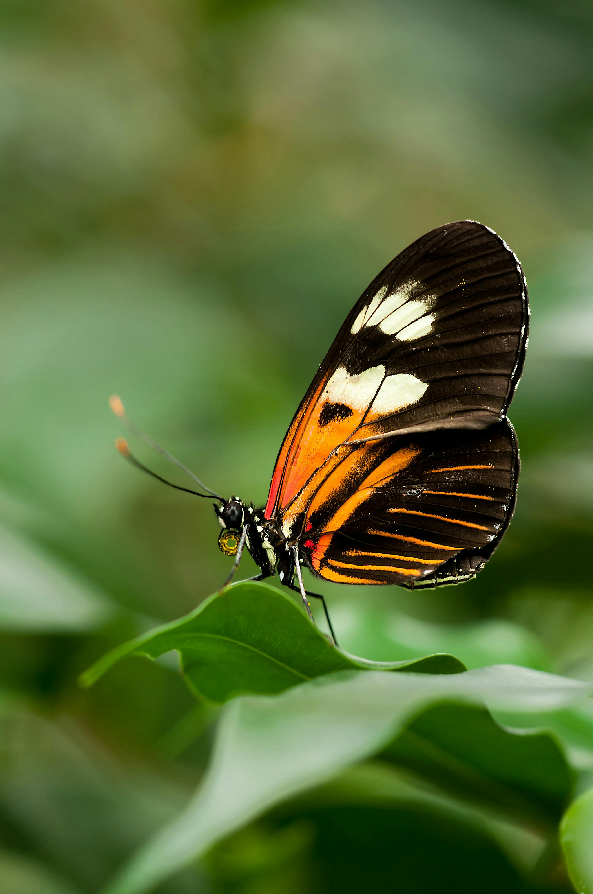

> **A Field Guide to Sampling Bias and Reproducibility**

Aka:: Butterflies and statistics[^1]

[^1]: *This post is a light-hearted exploration of sampling bias and reproducibility, using the metaphor of counting butterflies. It’s not a scientific paper, but a fun way to understand these concepts!*

    *This post emerged from the collision of two notes in my Obsidian vault:*

    -   *“Counting Butterflies” — sparked by a large brown butterfly that appeared outside my window.*

    -   *“Understanding Statistics in Medical Literature” — where I listed references for a teaching module.*

Looks like the butterfly didn’t just lead to chaos theory—it fluttered right into reproducibility.\
**Today, the Butterfly Sage speaks.**

## The Story flies: A Walk in the Park

Let’s say I ask you to go to a nearby park and give you a task—to count butterflies. You comply. Not because you have to (you’re not *really* my student—just joking!), but because you're curious.

Last week, you overheard someone say:

> *There are nowhere near as many butterflies now as there were when I was younger.*

That planted a seed in your mind. A hypothesis began to form:\
**The modern world has fewer butterflies.**

So you set out to test it. But soon, practical questions arise:

-   Should I walk or sit in one place?\
-   How do I avoid counting the same butterfly twice?\
-   What if I miss some?\
-   Should I lure them with fruit?

Eventually, you take a post-lunch stroll (glucose regulation bonus!), and count butterflies casually as you go.

You tally a number: **54**.

But now the questions deepen:

> Is that a high number? A low one? Is it accurate? What does it *really* represent?

Congratulations. You've just walked into **sampling bias**.

------------------------------------------------------------------------

## What Is Sampling Bias?

**Sampling bias** occurs when your data collection method causes a systematic deviation from the true picture of reality.

In your case:

-   You walked a convenient path.\
-   At a fixed time.\
-   You counted what was visible and easy to spot.

::: aside
My statistician friend rolls his eyes when he hears this definition. I have simplified things to understand them better, but it's not as simple as this reductionist view.

Read more about sampling bias here.
:::

Butterflies that were camouflaged, resting, flying too high, or active only at other times? All missed.

That means your sample is **not representative** of the total butterfly population.

------------------------------------------------------------------------

## Reproducibility Meets Sampling

Now imagine someone else wants to verify your result. But you didn’t log:\
- What time you walked.\
- Where exactly you walked.\
- How long you observed.\
- What you considered a valid “count.”

Even if they tried to repeat your study, they'd likely get a different number—not because the world changed, but because **your method wasn’t reproducible**.

> Reproducibility isn’t about producing the same number.\
> It’s about being able to follow the same method, and **understand why numbers differ**.

So:\
- Sampling bias distorts your observations.\
- Poor documentation makes it impossible to detect or correct that distortion.

::: callout-tip
### A reproducible method brings transparency

So even if someone else walks the path and sees 47 or 59, we can trace the difference to *variation*, not *bias*.
:::

------------------------------------------------------------------------

I know what you are thinking to counter argue with me!

> Even if I take the same path at the same time tomorrow, I might not see exactly 54 butterflies.

::: callout-note
Great question, That’s natural variation—not bias.\
But if you don’t log your method, how can anyone tell the difference?
:::

**Reproducibility doesn’t demand identical results—it demands clarity.**

So next time you walk:\
- Log your route, time, and weather.\
- Note how you count.\
- Be transparent in method.

That way, your butterfly data becomes more than a number—it becomes an observation that others can learn from, build on, and compare meaningfully.

------------------------------------------------------------------------

{fig-align="center" width="50%"}
