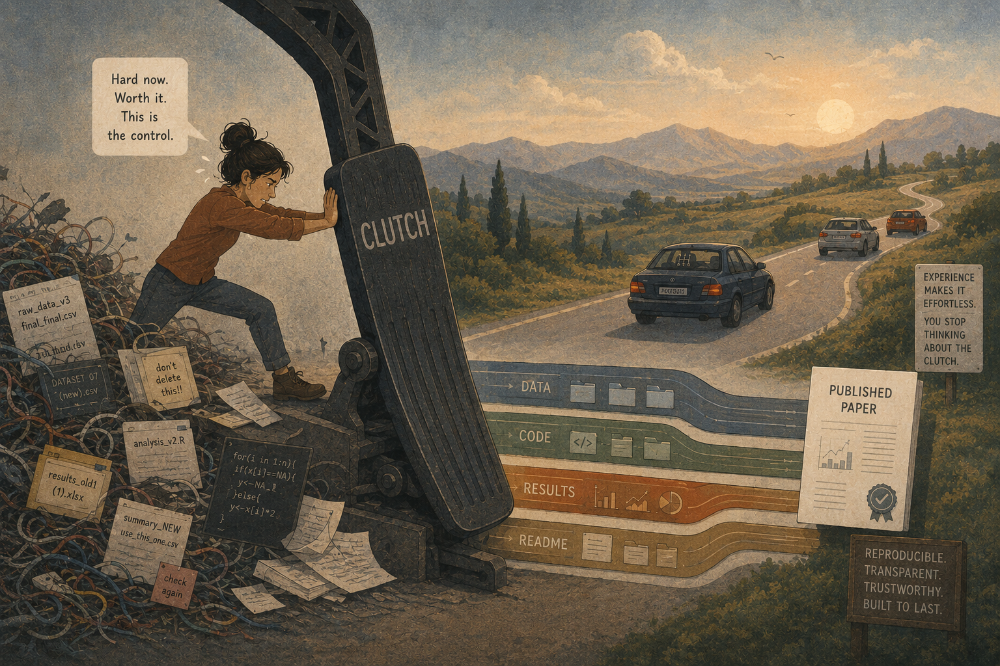

So I'm learning to drive.

I've been at it for about ten days now, and one thing occupies almost all of my attention: **the clutch**.

Everything else feels manageable, but the clutch demands complete cognitive effort. Every movement has to be intentional. Every release has to be controlled. There is nothing automatic about it.

And naturally, a question crossed my mind.

If learning a manual car is this difficult, why don't I just buy an automatic? After all, that's exactly why automatic cars exist.

Oddly enough, that question reminded me of something I hear whenever I talk about reproducible research.

People often ask why anyone would voluntarily choose a workflow that seems harder, slower, and demands more discipline when there are frictionless alternatives. Today we have tools that promise analyses at the click of a button, polished papers with minimal effort, and increasingly automated ways of doing science.

Why choose the harder path?

I think I've found my answer.

**Reproducibility is the clutch of science.**

The more I drive, the more I realize that the clutch isn't there to make driving difficult.

> It's there to give you control.

That changes everything.

The clutch demands a steep learning curve. It asks for your attention. It slows you down in the beginning. But in return, it gives you precision and control that an automatic transmission simply cannot offer.

I think reproducibility asks exactly the same of us. Building reproducible workflows isn't simply about being able to rerun an analysis. It is about something much deeper. It gives a researcher, agency over their own work. You know where every dataset came from. You know why every decision was made. You can retrace every step. You can regenerate every figure. Nothing feels mysterious anymore because the logic of your work lives alongside the work itself. That, to me, is real scientific control.

The second thing learning to drive has taught me is that we often mistake the learning curve for evidence that something isn't worth doing. Of course the clutch feels difficult. Of course version control feels overwhelming. Of course documenting every decision feels slower than simply getting on with the analysis. When we're beginners, we naturally think the resistance means we're taking the wrong road.

I don't think it does. I think the resistance *is* the road.

I've been thinking a lot lately about something I call *perfecting the means*. We often want mastery without respecting the process that creates it.

> Confusion is part of the process. Slowness is part of the process. Making mistakes is part of the process.

That isn't wasted effort. It's how we build the habits that eventually make good science almost effortless.

In driving, that initial slowness prevents catastrophic mistakes later. You learn exactly how much clutch to release, when to shift gears, and how to coordinate your movements until your body no longer has to think about them.

Science works the same way. The intentional friction we experience while learning reproducible workflows protects us from much larger failures later—analyses we cannot explain, figures we cannot regenerate, and conclusions we cannot defend. That friction is not something to dread. It's calibration.

And then something beautiful happens. The clutch slowly disappears. Because you've mastered it. Even in the short time I've been learning, I can already feel the difference. Movements that demanded complete concentration during the first few days are beginning to happen without quite so much conscious effort.

I imagine experienced researchers feel the same way about reproducibility. It no longer feels like an external burden or another item on a checklist. *It becomes how they think.* Their attention is no longer consumed by file organization, version control, or documentation because those habits have become second nature. Their mind is free to focus on the scientific questions instead. That's what mastery looks like.

People who have reached that stage rarely wish they had done less. They recognize that the difficulty wasn't an obstacle. The difficulty was the mechanism that gave them freedom.

So perhaps reproducibility isn't there to slow science down. Perhaps it's there to make science better. The automatic path often feels faster. The manual path feels frustrating in the beginning. But one gives convenience. The other gives control. And if science is ultimately about understanding rather than merely producing results, I know which one I'd rather learn.

> **So maybe reproducibility isn't just another research practice. It's the clutch of science.**

{fig-align="center" width="100%"}
